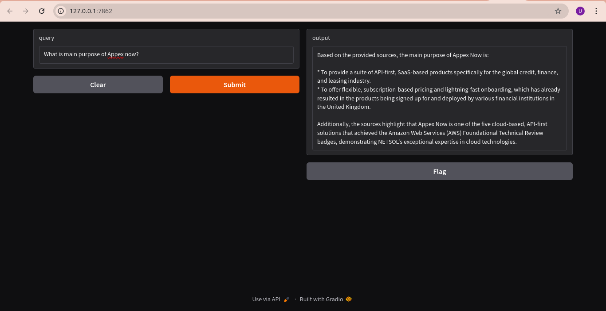
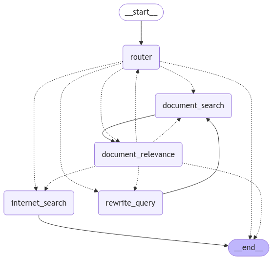

# Overview
This project contains basic RAG architecture implementation with langgraph, Tavily and Gradio.

# What does it do?

In this implementation Groq is used as LLM and the query is first passed to the router where a custom promt is constructed with the passed query and based on this prompot LLM decides whether the context for this query should be taken from the internet or the local document.

If LLM decides to use internet search then Tavily is used to search results with this query on the internet. A new prompt is constructed with 3 records return from Tavily API as context along with the original query.  

Otherwise query is converted to a vector embedding and document_search calculates the cosine similarity of the query embedding with all the embeddings saved in the database. In this implementation mongodb is used with docker based local instance. Similar to internet search top 3 records are added to the context and a new prompt is generated with original query and this context and based on this prompt LLM generates the answer.

On the next step LLM decides whether the answer is relevant to the orignal question if yes then end node is called otherwise rewrite query is called in which LLM rewrites the query based on the context and document relevance is called again with modified query. If the document search doesn't able to generate relevant results on 3 tries then the internet_search node is called which looks for online results for the context.

# Requiremnts
- python
- docker

# Setup
1. Install python dependencies `pip install -r requirements.txt`
2. Start local mongodb instance `docker-compose up -d`
3. Run all cells in `save_vectors.ipynb` file which essentially breaks page contents to chunks of 2000, convert those chunks to vector embeddings and saves them in the mongodb instance.
4. Run `python app.py` to start the gradio application and start using the application by opeing the link in the browser.

